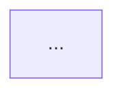

# BENCHMARK.md Output Template

The final `BENCHMARK.md` must follow **exactly** this structure (for the standard benchmark type). Custom benchmark types may replace or supplement the data-gathering sections — see "Custom Sections" and "Constraints" below.

```markdown
# Benchmark: {Feature Name}

> Generated from: {relative path to BRIEF.md}
> Market: {EU / US / APAC / Global / ...}
> Domain: {fashion / sport / fintech / domain-agnostic / ...}
> Benchmark type: {standard / compliance / user-research / internal-perf / market / custom}
> Date: {YYYY-MM-DD}

---

## Comparable Solutions

### {Competitor / Solution Name}
- **What it does:** {1–2 sentences}
- **Relevant approach:** {how it handles the problem your brief addresses}
- **Key differentiators:** {what makes it notable}
- **Gaps / weaknesses:** {where it falls short or doesn't apply}

{repeat for 3–5 comparable solutions}

---

## Technical Standards

- **{Standard or convention name}:** {what it specifies and why it's relevant}
- **{Library / framework convention}:** {common patterns in this domain}

{3–8 standards relevant to the feature}

---

## Key Metrics & Baselines

| Metric | Industry Baseline | Source / Notes |
|--------|------------------|----------------|
| {metric name} | {value or range} | {source, or "⚠️ Unverified — validate before use"} |

{3–6 metrics that will inform acceptance criteria in the SPEC}

---

## Gap Analysis

### What Existing Solutions Don't Cover
- {gap 1 — specific unmet need your brief addresses}
- {gap 2}

### What Your Brief Overlaps With
- {overlap 1 — where existing solutions already solve part of this}
- {overlap 2}

### Risks & Considerations
- {risk 1}
- {risk 2}

---

## Spec Recommendations

Based on the above research, the following should inform the SPEC:

- **Include:** {specific feature or behavior grounded in benchmarks}
- **Exclude (for now):** {scope boundary suggested by benchmark findings}
- **Validate before specifying:** {areas where more information is needed before writing ACs}

---

## Visual References *(frontend features only)*

### Competitor Layout Patterns

> These diagrams document existing solutions — they are references, not proposed designs.

#### {Competitor Name} — {Screen/Component Name}

```
{Unicode box-drawing diagram}
```

### User Flow Patterns

> Observed flow in {Competitor Name} — for reference only.



---

## {Custom Section Name} *(when using a non-standard benchmark type)*

{Content structured according to the benchmark type agreed upon during scoping.
Examples of custom sections:}

### User Research Findings *(user-research type)*
- **Persona:** {persona name}
- **Pain points:** {key pain points from research}
- **Quotes:** {relevant user quotes}

### Regulatory Requirements *(compliance type)*
- **{Regulation name}:** {what it requires and how it applies}
- **Compliance gaps:** {where the brief may fall short}

### Current System Baselines *(internal-perf type)*
| Metric | Current Value | Target | Notes |
|--------|--------------|--------|-------|
| {metric} | {current} | {target} | {notes} |

### Market Sizing *(market type)*
- **TAM:** {total addressable market}
- **SAM:** {serviceable addressable market}
- **SOM:** {serviceable obtainable market}

### Pricing Analysis *(market type)*
| Competitor | Pricing Model | Price Range | Notes |
|-----------|--------------|-------------|-------|
| {name} | {model} | {range} | {notes} |
```

## Constraints

- **Header metadata** — `Generated from`, `Market`, `Domain`, `Benchmark type`, and `Date` are always required in the header
- **3–5 comparable solutions** — well-researched entries; 3 thorough is better than 5 shallow *(standard type; may be replaced by custom sections in other types)*
- **3–8 technical standards** — protocols, specs, RFCs, library conventions relevant to the domain *(standard type; may be replaced or supplemented in other types)*
- **3–6 metrics** — measurable baselines that will inform SPEC acceptance criteria *(standard type; may be replaced or supplemented in other types)*
- **Gap Analysis** — must include all 3 subsections (unmet needs, overlaps, risks) — **always required regardless of benchmark type**
- **Spec Recommendations** — must include at least one each of Include, Exclude, and Validate — **always required regardless of benchmark type**
- **Visual References** — frontend features only; Unicode box-drawing + Mermaid flows; always captioned as reference
- **Custom sections** — when the user specifies a non-standard benchmark type, custom sections replace or supplement the data-gathering sections (Comparable Solutions, Technical Standards, Key Metrics); Gap Analysis and Spec Recommendations are never replaced
- **Unverified data** — flag with `⚠️ Unverified — validate before use`; include anyway
- **Generated from** — must reference the source BRIEF's relative path
